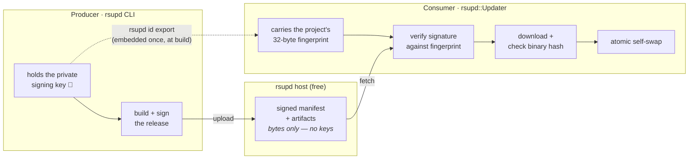

# rsupd

Signed release distribution and in-place auto-updates for Rust programs, built on the
[BottleFmt](https://github.com/BottleFmt) stack ([`bottlers`](https://crates.io/crates/bottlers)
for identity/signing, [`purecrypto`](https://crates.io/crates/purecrypto) for hashing,
[`compcol`](https://crates.io/crates/compcol) for compression).

rsupd is the Rust successor to [`goupd`](https://github.com/KarpelesLab/goupd): it keeps the
atomic binary-swap-and-restart mechanics but replaces goupd's plaintext update files with a
**cryptographically signed manifest**, so a program can trust an update with nothing but a
32-byte fingerprint baked into it.

---

## The mental model

There are two sides and one rule.



(Producer and consumer are usually the **same project** — rsupd itself is both. The fingerprint is
the producer's, derived from its signing key and compiled into the consumer at build time; only the
*private key* stays producer-only.)

rsupd (the hosting service) is free for anyone to publish to. It only stores bytes — it
never holds your keys and cannot forge or force an update, because the signing key (yours)
is the sole source of trust. A compromised or malicious host can withhold updates, but it
can never make your users install something you didn't sign.

**The rule:** the consumer trusts exactly one thing — the **fingerprint** (a 32-byte SHA-256
of the project's signing public key) that you compile into it. Everything else (the manifest,
the host it came from, the binary) is verified against that anchor. Whoever holds the private
signing key can publish; nobody else can, no matter what they control.

---

## Getting started

There are two roles: you **publish** signed releases (a one-time setup with the `rsupd` CLI),
and your **program consumes** them (a few lines of the `rsupd` library). Here is the whole path.

### 1. Create the signing identity and CI — once, publisher side

```sh
cargo install rsupd --features _cli   # the producer CLI (the library default is the updater)
rsupd id init   --project myapp       # creates ~/.config/rsupd/myapp/identity.bin
rsupd id export --project myapp       # prints the 32-byte trust anchor as hex (paste it into your app)
rsupd publish --setup-ci --full       # build.rs + multi-platform CI + a sign/publish job
```

Guard `identity.bin` — it is the signing key. `--setup-ci --full` also uploads it as the
`RSUPD_IDENTITY` CI secret and adds a tag-gated job that builds every platform and publishes
signed binaries, so cutting a release becomes "push a `v*` tag". (Use plain `--setup-ci` to scaffold
the build without the secret upload / auto-publish.)

### 2. Add the updater to your program

```sh
cargo add rsupd     # the default is the consumer updater — no features needed
```

```rust
fn updater() -> rsupd::Result<rsupd::Updater> {
    rsupd::Updater::builder(env!("CARGO_PKG_NAME"), env!("CARGO_PKG_VERSION"))
        // The trust anchor from `rsupd id export`. It's a hash of a public key,
        // so it's safe to paste right into your source.
        .fingerprint_hex("925804220841644e23b6c756b2dc3e611374d08eeb24918fcff0161401da8334")
        .build() // fetches from the dist-go host by default
}
```

That is the whole integration — the channel defaults to `master` (matching `rsupd publish`), and the
transport defaults to the dist-go `HttpTransport`. *Optional:* to also detect a **rebuild of the same
version**, add a `build.rs` (`rsupd publish --setup-ci` writes one) and feed its stamps in:

```rust
        .git_tag(env!("RSUPD_GIT_TAG"))
        .date_tag(rsupd::date_tag_from_unix(env!("RSUPD_BUILD_UNIX")))
```

### 3. Trigger updates — pick the mode that fits

**Command-line tool** — update when asked, then exit:

```rust
fn main() {
    rsupd::honor_startup_delay(); // settle briefly if an update just restarted us
    if std::env::args().any(|a| a == "--update") {
        match updater().and_then(|u| u.update()) {
            Ok(true)  => println!("updated"),
            Ok(false) => println!("already up to date"),
            Err(e)    => eprintln!("update failed: {e}"),
        }
        return;
    }
    // ... your normal command ...
}
```

**Daemon / long-running** — check hourly in the background and restart into the new build:

```rust
fn main() {
    rsupd::honor_startup_delay();
    if let Ok(u) = updater() {
        u.spawn_auto_update(/* check immediately = */ false); // hourly; installs + restarts
    }
    // ... run your service ...
}
```

A successful update **restarts** the process into the new binary by default; pass
`.auto_restart(false)` to the builder if you'd rather apply the swap and handle the restart yourself.

### 4. Verify, then ship

```sh
rsupd check                          # confirms the fingerprint is embedded and the updater is wired
git tag v1.2.3 && git push --tags    # CI builds every platform, signs, and publishes
```

`rsupd check` exits non-zero when something is missing (so it works as a CI gate) and prints
copy-paste fixes for whatever it finds.

---

## Security model

This is the part worth understanding in full.

### Identity

Each project owns an **identity**: an Ed25519 **signing key** (the primary, "self" key) plus an
X25519 encryption key, packaged as a signed `IDCard` (the public half) alongside an encrypted
`keychain` (the private half). It lives at `~/.config/rsupd/<project>/identity.bin` and is
created once with `rsupd id init`. The signing key is the only one the release path uses; guard
it like any other code-signing key — anyone who has it can publish updates your users will trust.

### The fingerprint is the trust anchor

`rsupd id export` prints the 32-byte SHA-256 of the signing public key as hex, which you paste
into your program via `.fingerprint_hex("..")`. That single constant is the **entire** basis of trust: no key servers, no
certificate chains, no TLS pinning. It is public (a hash of a public key), so commit it freely.

### The manifest is a signed document

A release is described by a **manifest** — an integer-keyed CBOR map (bottlers house style):

| key | field | key | field |
|-----|-------|-----|-------|
| 1 | format version | 6 | git short hash |
| 2 | project | 7 | released (unix time) |
| 3 | channel | 8 | the project's IDCard (public) |
| 4 | version (semver) | 9 | artifacts |
| 5 | date tag (`YYYYMMDDhhmmss`) | | |

Each **artifact** is itself an int-map: `target`, `filename`, `compression`, `raw_size`, `size`,
and a `hash` (`["sha256", <digest>]`) **over the uncompressed binary**. The whole manifest is
sealed in a `bottlers::Bottle` and **signed by the project's Ed25519 key**. Note it embeds the
project's full IDCard — so the consumer can recover the public key with no out-of-band fetch.

### What happens on an update — the verification chain

When the consumer checks for an update, **the signature is verified before anything is
downloaded**, and the binary is verified before anything is replaced.

1. **Fetch + verify the manifest** (`Manifest::open_and_verify`), in order:
   1. the signed CBOR bottle opens;
   2. the IDCard embedded in it is validly **self-signed**;
   3. that IDCard's fingerprint **equals the fingerprint compiled into the consumer**;
   4. the manifest bottle is **signed by that same key**.
2. **Applicability checks:** the manifest's project and channel match, it carries an artifact for
   the running host, and it is **strictly newer** than the running build (see below).
3. **Download** the (compressed) artifact for this host.
4. **Verify before replacing** (`decode_and_verify`): the stored size matches, it decompresses to
   exactly `raw_size` (capped at 2× as a guard), and the **SHA-256 of the decompressed binary
   matches the hash in the signed manifest**.
5. **Atomically install:** write `.<name>.new`, rename the current binary to `.<name>.old`, move
   the new one into place, restore on failure. (A running Windows executable that can't be
   deleted is hidden instead.)

The integrity chain is therefore: **embedded fingerprint → manifest signature → trusted hash →
artifact bytes**. The binary's hash is only believed because it lives inside a document signed by
the key whose fingerprint you pinned. Tampering with the binary *or* the hash fails.

### "Newer" is precise

A release is installed only if it is strictly newer than the running build:

- greater semver version → update;
- **equal** version → update only if the manifest's `date_tag` (git commit time) is strictly
  greater than the running build's;
- same git short hash → it's the same build, skip.

For this to work the running binary must know its own build identity. A `build.rs` captures the
git short hash and commit time at compile time (`RSUPD_GIT_TAG` / `RSUPD_BUILD_UNIX`); the updater
is told about them via `.git_tag(...)` / `.date_tag(...)`. Built outside a git checkout (e.g. from
a crates.io tarball) these are empty and the comparison falls back to plain semver. The net effect:
**rsupd never downgrades**, and never reinstalls an identical build.

### Threat model — what this does and does not protect against

- **A hostile mirror / MITM / DNS hijack** cannot forge an update: without the signing key they
  can't produce a manifest that verifies against your fingerprint, and a tampered binary won't
  match a validly-signed hash. This is why the distribution host is **not** the trust boundary —
  the download URL doesn't need to be authenticated, and pinning the host (below) is about
  operational consistency, not security.
- **Rollback is prevented** in the sense that the consumer only installs strictly-newer versions; a
  replayed older (but validly-signed) manifest is ignored.
- **What it does *not* prevent:** an attacker who controls the network can *suppress* updates
  (keep serving the current valid manifest, so you simply never see a new one) — manifests carry a
  timestamp but no enforced freshness/expiry. And, as with any signing scheme, **compromise of the
  private signing key is total** — the holder can sign malicious updates. Protect the key; in CI it
  lives only as the `RSUPD_IDENTITY` secret (below).
- The encryption (X25519) key in the identity is advertised in the IDCard but is **not** used by
  the release-signing path; releases are signed, not encrypted.

---

## Producer — building and publishing a release

The producer is the `rsupd` CLI, which lives behind the crate's non-default `_cli` feature:
`cargo install rsupd --features _cli` (or use a prebuilt binary). The library you depend on in
your app needs no feature — it's the consumer updater by default.

```sh
# 1. one-time: create the project signing identity, and export its fingerprint
rsupd id init   --project myapp
rsupd id export --project myapp                # prints the fingerprint hex to embed in the app

# 2. compile your binaries (natively and/or cross-compiled)
cargo build --release                          # plus any `--target <triple>` builds

# 3a. build a signed package from target/<triple>/release/  (offline artifact)
rsupd build -C . -o myapp.zip

# 3b. …or build + confirm + upload in one step
rsupd publish                                  # binaries from the local target/ tree
rsupd publish --ci                             # binaries downloaded from a CI run (see below)

# inspect / verify a package, and self-check your wiring
rsupd inspect myapp.zip
rsupd check
```

The package is a plain store-mode `.zip` (`unzip`-readable) containing `manifest.cbor` plus one
zstd-compressed archive per target, named flat as `<bin>_<target>.zst`. `--naming` chooses the
target label: `os_arch` (default, e.g. `myapp_linux_amd64.zst`) or full `triple` (e.g.
`myapp_x86_64-unknown-linux-musl.zst`, when one `os_arch` slot isn't specific enough). A single
macOS universal (fat) binary is published under the `darwin_universal` label and matches either
Apple arch. The channel defaults to the current git branch (falling back to `master`).

`rsupd check` is the doctor: it statically verifies that each `[[bin]]` constructs the updater and
embeds the right fingerprint, and that a `build.rs` build identity and a CI build config are
present — printing the exact `rsupd …` command to fix whatever is missing. It exits non-zero when a
required item is missing, so it doubles as a CI / pre-release gate.

---

## Distribution layout

`rsupd publish` uploads to the `Cloud/Rust:upload` endpoint of the rsupd hosting service — a free
file host for anyone distributing rsupd-signed releases. It stores bytes only: no account-bound
keys, and (as above) it can't influence what your users accept, since trust comes entirely from
your signature. The layout (where `<name>` is the base64url of the project fingerprint):

```
https://dist-go.tristandev.net/rust/<name>/MANIFEST-<channel>     ← moving pointer to the latest manifest
https://dist-go.tristandev.net/rust/<name>/<version>/<filename>   ← each artifact (immutable)
```

Versions are immutable server-side: re-publishing an existing `<version>` is rejected, so a
released artifact set can't be silently overwritten.

---

## Consumer reference

The minimal integration is in [Getting started](#getting-started) above. A few details:

- **Builder knobs** (`rsupd::Updater::builder(name, version)`): `.fingerprint_hex("..")` (or
  `.fingerprint(bytes)` for raw bytes) — required, the trust anchor; `.channel(..)` (defaults to
  `master`, must match how you publish);
  `.git_tag(..)`/`.date_tag(..)` (optional build identity for same-version detection);
  `.transport(..)` (optional, defaults to the dist-go `HttpTransport`); `.auto_restart(bool)`
  (default `true`).
- **Applying updates:** `check()` returns an `Available` (`.version()`, `.git_tag()`) without
  touching disk; `install(&available)` swaps the binary in place; `update()` does check + install
  (+ restart unless disabled); `spawn_auto_update(immediate)` runs that on an hourly background
  thread.
- **Target selection:** `rsupd::TARGET` is the running build's exact triple (captured by
  `build.rs`); the updater matches the artifact by it (or the compact `os_arch` label), falling
  back to `darwin_universal` on macOS.
- Call `rsupd::honor_startup_delay()` early in `main()` so a process that was just restarted by an
  update settles briefly before doing work.

### Transports

- **`HttpTransport`** — the real network transport. It fetches manifests/artifacts from the fixed
  `dist-go` host using the fingerprint-derived path. The host is deliberately not configurable;
  recall it is not the trust boundary.
- **`ZipPackageTransport`** — serves a local package `.zip`, running the entire
  check → verify → install path offline. Useful for tests and sideloading.

You can implement the `rsupd::Transport` trait yourself to fetch from anywhere; all signature and
hash verification happens in the updater regardless of where the bytes come from.

### Self-update CLI

`rsupd` is itself a consumer: `rsupd version` prints its version, build identity and target, and
`rsupd update` downloads and installs the latest matching release in place.

---

## CI — building and publishing automatically

`rsupd publish --ci` sources the per-platform binaries from a CI run instead of the local tree: it
uses `gh` (GitHub) or `glab` (GitLab) — auto-detected, or `--provider` — to download a run's
artifacts, expecting **one artifact named after each Rust target triple** containing the compiled
binary.

`rsupd publish --setup-ci` scaffolds that for you: a `build.rs` (build identity) plus a build
workflow (`.github/workflows/build.yml` or a marked block in `.gitlab-ci.yml`) whose matrix builds
every supported target — Linux amd64/arm64/armv7, Windows amd64/arm64, and a single macOS universal
binary via `lipo` — and uploads each as a triple-named artifact.

`rsupd publish --setup-ci --full` goes further: it uploads the signing identity as the
`RSUPD_IDENTITY` secret (base64 of `identity.bin`, piped to `gh`/`glab`, with a confirmation
prompt) and adds a tag-gated `publish` job that builds, signs and uploads the release
unattended. In CI, rsupd reads the identity straight from `RSUPD_IDENTITY` (via
`Identity::load_env_or_file`) — no filesystem setup, and the on-disk identity is used as a fallback
when the variable is unset. The publish job assumes the identity has no keychain password.

---

## Status

Complete and in use: identity/signing, the signed manifest, packaging, the producer CLI
(`id`, `build`, `publish`, `inspect`, `check`, `version`, `update`), the consumer updater
(verify → download → hash-check → atomic swap → restart), the `HttpTransport` over `dist-go`, and
the GitHub/GitLab CI scaffolding including the full sign-and-publish pipeline.

## License

MIT
